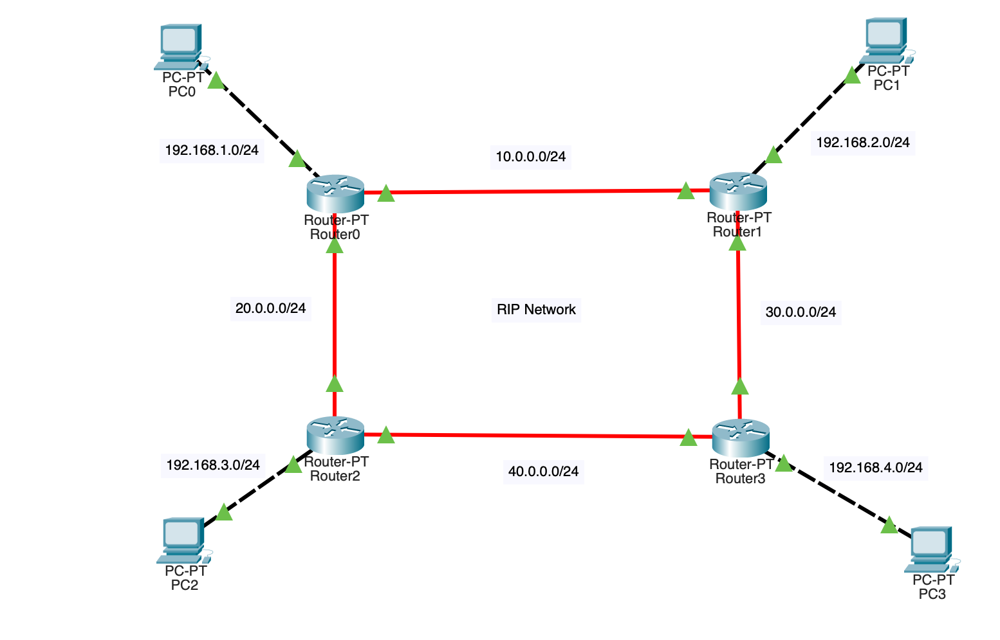

# Network Configuration: RIP Setup

## Overview

This section provides the configuration steps for setting up the Routing Information Protocol (RIP) on a Cisco router. The following configuration uses RIP version 2 and includes multiple network addresses.

## Configuration Steps

1. **Enter Global Configuration Mode:**
    ```plaintext
    Router0# en
    Router0# conf t
    ```
2. **Enter RIP Routing Configuration Mode:**
    ```plaintext
    Router0(config)# router rip
    ```
3. **Set RIP Version to 2:**
    ```plaintext
    Router0(config-router)# version 2
    ```
4. **Specify Network Addresses:**
    - **Network hop1**: 192.168.1.0
    - **Network hop2**: 10.0.0.0
    - **Network hop3**: 20.0.0.0

    ```plaintext
    Router0(config-router)# network 192.168.1.0
    Router0(config-router)# network 10.0.0.0
    Router0(config-router)# network 20.0.0.0
    ```
5. **Exit RIP Configuration Mode and Global Configuration Mode:**
    ```plaintext
    Router0(config-router)# exit
    Router0(config)# exit
    ```

6. **Save Configuration to Memory:**
    ```plaintext
    Router0# write memory
    ```


## Explanation
- **RIP Version 2**: This configuration sets the router to use RIP version 2, which supports classless routing and includes subnet mask information in its routing updates.
- **Network Statements**: The `network` commands specify which networks will participate in RIP routing. The router will advertise these networks to other RIP-enabled routers.
- **Saving Configuration**: The `write memory` command saves the configuration to the router's startup configuration file so that it persists across reboots.
